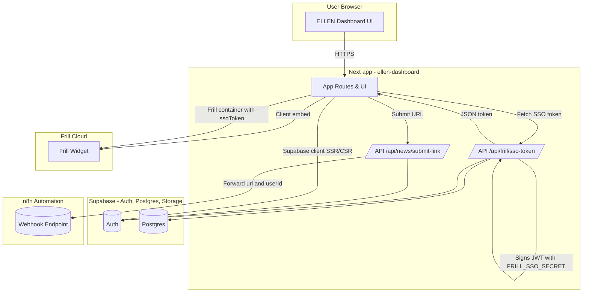
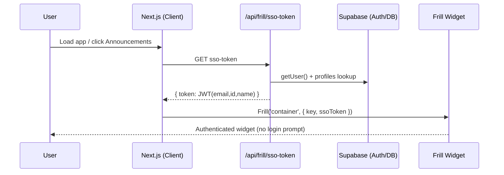
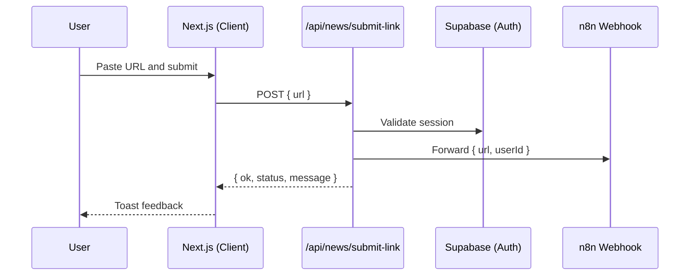

# Ellen — Architecture Overview (current main)

This document captures the current architecture present in the main branch, including the Next.js dashboard, Supabase backend, Frill SSO, and auxiliary integrations.

## 1) System Context (Current)

Key pieces in repo:
- `ellen-dashboard/` — Next.js app (app router) with global providers and API routes.
- `ellen-dashboard/components/providers/frill-widget.tsx` — loads Frill widget and injects SSO token.
- `ellen-dashboard/app/api/frill/sso-token/route.ts` — generates HS256 SSO JWT with `{ email, id, name }`.
- `ellen-dashboard/app/api/news/submit-link/route.ts` — forwards submitted links to n8n webhook.
- `supabase/migrations/` — database migrations (e.g., profiles, messages metadata, etc.).

Environment:
- `NEXT_PUBLIC_FRILL_KEY` — Frill widget key (client).
- `FRILL_SSO_SECRET` — Frill SSO secret (server only).
- `N8N_NEWS_WEBHOOK_URL` — n8n webhook for news links.

## 2) Frill SSO Flow (Detailed)

## 3) News Submission Flow

## 4) Repo structure in play
- Dashboard UI and APIs: `ellen-dashboard/`
- Data & migrations: `supabase/`
- Exported DB data & scripts: `db_export/`, `*.py` (knowledge graph/ingestion tooling)
- V2 (planned, Azure-native): `ellen_v2/` with `infra/` (Bicep), `services/` (e.g., crew-orchestrator, ingestion-service), `apps/frontend/` (future client). This directory represents the target platform but is not the current prod stack.

## 5) Notes
- Authentication: Supabase session used both client- and server-side (SSR-friendly). No '@supabase/auth-helpers-nextjs'.
- Frill: SSO JWT includes `email`, `id`, `name` and is short-lived; token never exposed in env.
- Announcements: Thin sidebar button `#ellen-announcements-button` opens Frill; notification dot managed via widget/custom logic.
- News ingestion: n8n endpoint is external; API passes along the authenticated user context.
